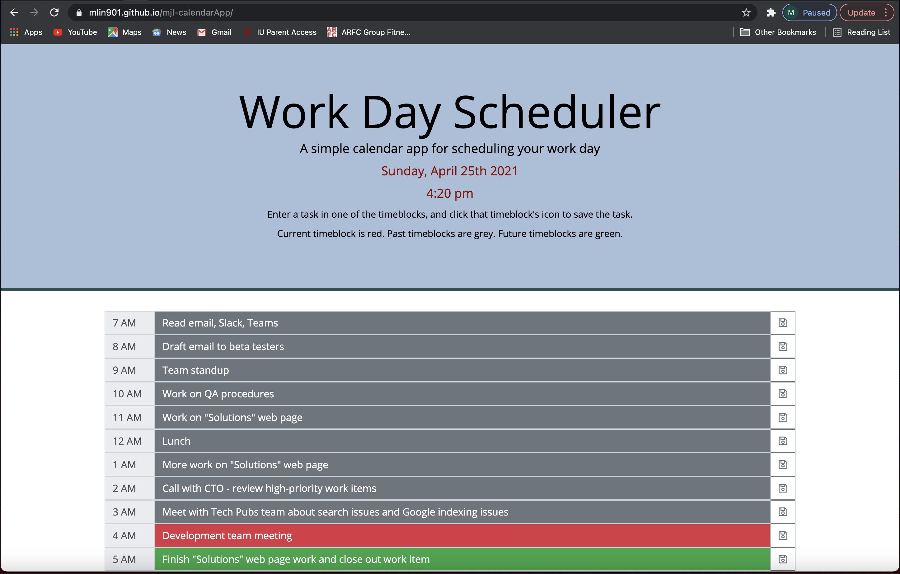

# mjl-calendarApp

This assigment, which is the homework for the 05-Third-Party-APIs section of bootcamp, was to create a calendar app to save tasks for different timeblocks in the current day. To add a task, the user enters the task in the form field for one of the timeblocks and then clicks the save button for that timeblock. When the button is clicked, the task remains displayed and is saved to local storage. When the app page is refreshed, saved tasks are retrieved from local storage and displayed in their respective timeblock input fields. 

This app was implemented using a number of web developement techologies, including

* Moment.js for the date display and to determine which timeblocks should be grey (past), red (current), and green (future)
* Font Awsome for the icon on the Save buttons
* Bootstrap for the heading area and for most aspects of timeblocks (labels, input fields, save buttons)
* Bootstrap classes to control input field colors
* JavaScript and jQuery to acess/manipulate DOM elements and to dynamically add timeblock HTML.

I chose to use Bootstrap classes to control input field colors, even though they're not ideal for this app. (They're too bright and the class names don't reflect their purpose in this context.) I chose them just to get more experience in using Bootstrap features. In other cases, though, I used styles in style.css to customize Bootstrap colors and formatting.

Links:

* [Published app](https://mlin901.github.io/mjl-calendarApp/)
* [Screen capture (below)](#screencap)

License: MIT

There are no media queries in this app because the primary elements are Bootstrap components, so Bootstrap does the work of making this app responsive. And it is responsive: Chrome developer tools indicates that it works fine down to about 350px wide (when set to "Responsive"), and it works fine for most device settings (the items under "Responsive" in the dropdown list--e.g., iPad).

A couple of features are, of course, glaringly absent: the ability to change days and a feature to clear tasks. To implement the former, there would need to be a calendar selector field, the displayDate() function would need to be updated to display the chosen date (the current date by default), and the get/set code for local storage would need to be updated to include the date in the local storage keys. As for a feature to clear tasks, I think that's a usability question. Would it be better to add a "remove task" button to each timeblock, or add just one "clear" button at the bottom of the page to clear out all timeblocks for the day? Maybe both. 

## Screen capture

